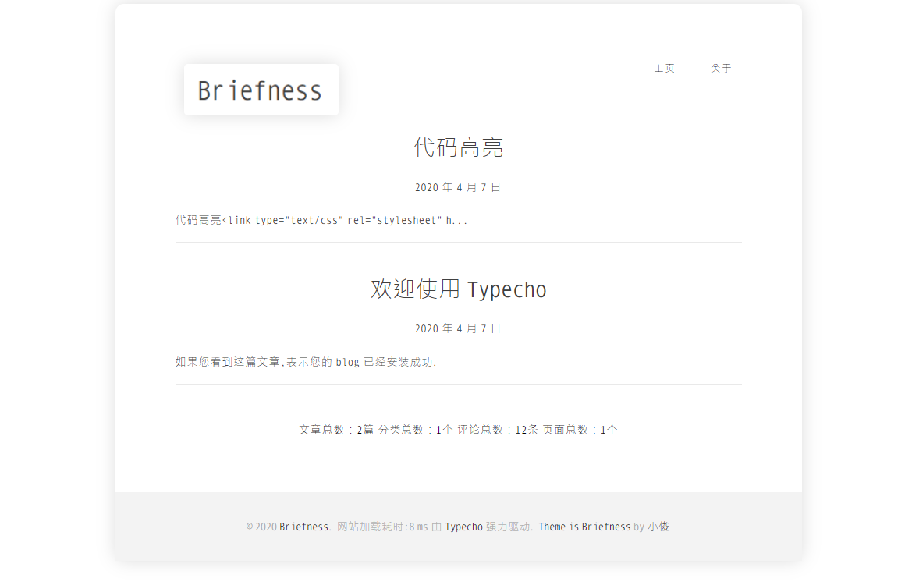

# Briefness
一款简约的单栏 Typecho 主题，极致简洁的风格

点击加入 Briefness 用户交流群：[199175766](https://jq.qq.com/?_wv=1027&k=3tN6NBuF)

<p align="center">

</p>        


## About

一款简约的单栏 Typecho 主题，极致简洁的风格 🎉

## Structure
在下载中，您将找到以下目录和文件  你会看到这样的东西 👇

```
Briefness
│  404.php
│  archive.php
│  comments.php
│  footer.php
│  functions.php
│  header.php
│  index.php
│  LICENSE
│  page.php
│  post.php
│  README.md
│  Screenshot.png
│  style.css
│  
├─assets
│  ├─css
│  │      clickright.css
│  │      lightbox.css
│  │      
│  └─js
│          clickright.js
│          lightbox.js
│          main.js
│          
├─font
│      monofonto.ttf
│      MonoSpatial.ttf
│      
├─img
│      close.png
│      favicon.ico
│      logo.png
│      next.png
│      prev.png
│      
└─prism
        line-numer.css
        prism.css
        prism.js
```

## Changelog
每个版本的详细更改记录在 [release notes](https://github.com/laulzgoay/Briefness/releases).

## Donation
如果您发现Briefness有用，可以给我们买包辣条 🎉

[Donation](https://www.xjisme.com/sponsor.html)

## License

The code is available under the [MIT](https://github.com/laulzgoay/Briefness/blob/master/LICENSE) license.

The document is licensed under a [Creative Commons Attribution-NonCommercial-NoDerivatives 4.0 International License](http://creativecommons.org/licenses/by-nc-nd/4.0/).
